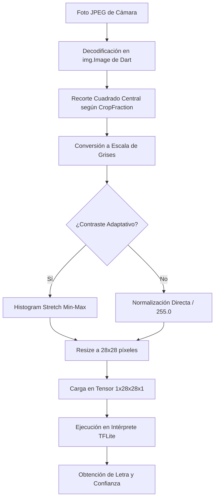

# Detección de Lenguaje de Señas (ASL) · UTN FRLP 2026

Una aplicación móvil y desktop desarrollada en **Flutter** para la cátedra de **Inteligencia Artificial (2026)** de la **Universidad Tecnológica Nacional - Facultad Regional La Plata (UTN FRLP)** por el **Grupo 5**.

La aplicación integra un motor de inferencia local basado en **TensorFlow Lite** para clasificar señas correspondientes a letras del abecedario dactilológico (ASL MNIST / ASL Alphabet) de forma **100% offline**, privada y eficiente.

---

# Características Principales

- **Motor TFLite Offline Local Nativo**: inferencia directa en el dispositivo en un hilo dedicado, garantizando máxima privacidad, latencia ultra baja (~1-5 ms) y funcionamiento autónomo sin necesidad de internet ni servidores externos.

- **Detección por Captura Manual (Snapshot)**: en lugar de mantener un flujo continuo de video, el usuario encuadra su mano dentro de la guía y presiona **"CAPTURAR Y ANALIZAR"**. El sistema toma una fotografía mediante `CameraController.takePicture()`, procesa la imagen y ejecuta la inferencia.

- **Toggle Inteligente de Lente (Frontal/Trasera)**: permite alternar rápidamente entre las cámaras disponibles.

- **Espejado y Ajustes Automáticos**: la aplicación adapta automáticamente el espejado según la cámara seleccionada.

- **Panel de Calibración**:
  - **Área de Enfoque (Crop Fraction)**: controla el porcentaje central de la imagen utilizado para el análisis.
  - **Espejar Cámara Manual**: permite invertir horizontalmente la imagen cuando sea necesario.
  - **Contraste Adaptativo**: aplica estiramiento dinámico de histograma durante el preprocesamiento.

---

# Pipeline de Preprocesamiento de Imagen

Para garantizar una clasificación precisa, el preprocesamiento replica el flujo utilizado durante el entrenamiento del modelo:



**Resize Cúbico:** la librería de imágenes nativa de Dart utiliza interpolación cúbica para aproximar el comportamiento del filtro `LANCZOS` empleado durante el entrenamiento original, minimizando pérdidas de información durante la reducción a 28x28 píxeles.

---

# Guía de Instalación y Ejecución

## Prerrequisitos

- **Flutter SDK** `>=3.18.0`
- **Cocoapods** (para macOS/iOS)
- Dispositivo físico o emulador con soporte de cámara y FFI

## Paso 1: Clonar el Repositorio

```bash
git clone https://github.com/blauerwolf/ia-grupo-5-2026-android-app.git
cd ia_app
```

## Paso 2: Instalar Dependencias

Instala los paquetes necesarios:

```bash
flutter pub get
```

## Paso 3: Configurar Assets

Verifica que exista el siguiente archivo:

- `assets/modelo_sign_language.tflite`


## Paso 4: Ejecutar la Aplicación

Conecta un dispositivo físico o inicia un emulador y ejecuta:

```bash
flutter run
```

---

# Pruebas Automatizadas

El proyecto incluye pruebas de widgets e integración para validar la correcta renderización y funcionamiento de la aplicación.

Para ejecutar la suite de pruebas:

```bash
flutter test
```

---

# Tecnologías Utilizadas

- Flutter
- Dart
- TensorFlow Lite
- Camera Plugin
- Image Package
- Flutter Test
- Material Design 3

---

# Integrantes · Grupo 5 (UTN FRLP IA 2026)

- Diego Alberto Meretta
- Hernán Suárez
- Ernesto Ardenghi
- Ignacio Cangaro
- Guillermo Del Vecchio
- Nahir Chosco
- Valentín Garzaniti
- Pilar Giannelli

---

**Universidad Tecnológica Nacional – Facultad Regional La Plata**  
**Cátedra de Inteligencia Artificial**  
**Año 2026**