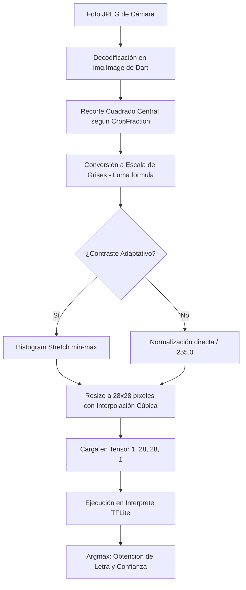

# 🤟 Detección de Lenguaje de Señas (ASL) · UTN FRLP 2026

[](https://flutter.dev/)
[](https://www.tensorflow.org/lite)
[](LICENSE)

Una aplicación móvil y desktop premium desarrollada en **Flutter** para la cátedra de **Inteligencia Artificial (2026)** de la **Universidad Tecnológica Nacional - Facultad Regional La Plata (UTN FRLP)** por el **Grupo 5**. 

La aplicación integra un motor de inferencia local basado en **TensorFlow Lite** para clasificar señas correspondientes a letras del abecedario dactilológico (ASL MNIST / ASL Alphabet) de forma 100% offline, privada y eficiente.

---

## ✨ Características Principales

*   **🧠 Motor TFLite Offline Local Nativo**: Inferencia directa en el dispositivo en un hilo dedicado, garantizando máxima privacidad, latencia ultra baja (~1-5 ms) y funcionamiento autónomo sin necesidad de internet ni servidores externos.
*   **📸 Detección por Captura Manual (Snapshot)**: En lugar de saturar el hardware con streams de video constantes, el usuario encuadra su mano dentro de la guía y presiona **"CAPTURAR Y ANALIZAR"**. El sistema toma una foto real en alta resolución mediante `CameraController.takePicture()`, lee sus bytes e inicia el pipeline.
*   **🔄 Toggle Inteligente de Lente (Frontal/Trasera)**: Un botón dinámico en la cabecera permite alternar al instante entre las cámaras frontal y trasera.
*   **🪞 Espejado y Ajustes Automáticos**: La aplicación espeja automáticamente la vista previa y la inferencia al usar la cámara frontal para una visualización natural del usuario, y desactiva el espejado al cambiar a la cámara trasera.
*   **⚙️ Panel de Calibración Premium**:
    *   **Área de Enfoque (Crop Fraction)**: Controla visualmente el porcentaje del centro de la pantalla analizado por el modelo (de 20% a 100%).
    *   **Espejar Cámara Manual**: Switch para invertir horizontalmente de forma forzada si es necesario.
    *   **Contraste Adaptativo**: Estiramiento de histograma dinámico min-max integrado en el preprocesamiento de tensores.
---

## 🛠️ Pipeline de Preprocesamiento de Imagen

Para garantizar que el modelo clasifique con precisión, el preprocesamiento replica de forma matemática y exacta el flujo de entrenamiento del dataset original y del script de referencia `deteccion.py`:



*   **Resize Cúbico**: La librería de imágenes nativa de Dart utiliza interpolación cúbica para aproximar con exactitud el filtro `LANCZOS` empleado en el entorno Python PIL original, evitando que la reducción agresiva a 28x28 píxeles genere ruido matemático.

---

## 🚀 Guía de Instalación y Ejecución

### Prerrequisitos
*   **Flutter SDK**: `>=3.18.0` (recomendado el uso del canal estable).
*   **Cocoapods** (para macOS/iOS).
*   Dispositivo físico o emulador con soporte de cámara y FFI.

### Paso 1: Clonar el Repositorio
```bash
git clone https://github.com/blauerwolf/ia-grupo-5-2026-android-app.git
cd ia_app
```

### Paso 2: Instalar Dependencias
Instala los plugins de Flutter nativos (incluyendo `tflite_flutter` y `camera`):
```bash
flutter pub get
```

### Paso 3: Configurar Assets
Asegúrate de que el modelo TFLite y las imágenes de prueba se encuentran en las ubicaciones requeridas indicadas en `pubspec.yaml`:
-   `assets/modelo_sign_language.tflite`
-   `assets/letra_a.png`
-   `assets/letra_u.png`

### Paso 4: Ejecutar la Aplicación
Conecta tu celular o inicia un simulador y ejecuta:
```bash
flutter run
```

---

## 🧪 Pruebas Automatizadas

El proyecto incluye tests de widgets e integración que verifican la renderización correcta y robusta de la interfaz principal libre de excepciones:

Para correr las pruebas locales ejecuta:
```bash
flutter test
```

---

## 👥 Integrantes - Grupo 5 (UTN FRLP IA 2026)

*   **Estudiante 1** - [blauerwolf](https://github.com/blauerwolf) (o nombres reales de los participantes del grupo)
*   **Estudiante 2**
*   **Estudiante 3**

*UTN FRLP · Inteligencia Artificial · Año 2026*
